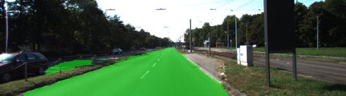

# Semantic Segmentation
### Introduction
In this project, you'll label the pixels of a road in images using a Fully Convolutional Network (FCN).

### The program
1. load the pretrained vgg model
2. add the transpose convolutional layers
3. train the model

### Hyperparameters
The hyperparameters i used for trainning are shown in below:
1. keep_prob = 0.5
2. learning_rate = 0.0009
3. epochs = 15
4. batch_size = 8

### Result
Here are some result:

